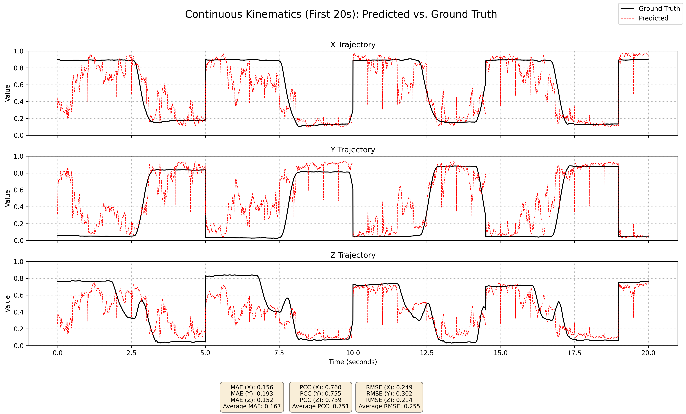
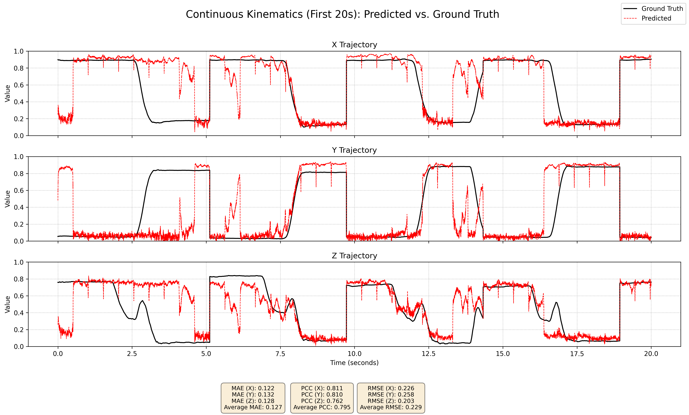

# Motion Trajectory Reconstruction from EEG Signals

This repository contains the code accompanying our work on **decoding continuous movement trajectories from non-invasive EEG** using deep learning.
[Our Report](./Motion_Trajectory_Reconstruction.pdf) and [Presentation](./EEG_presentation.pdf)

We implement and compare three architectures for **EEG → 3D kinematics** regression / translation:

- **CNN + LSTM** (hybrid spatio-temporal baseline inspired by PreMovNet)
- **Modified Pix2Pix cGAN** adapted from image-to-image translation to **signal-to-signal** translation using **1D convolutions**
- **Convolutional Autoencoder (CAE)** for sequence reconstruction / regression

The models are evaluated on two datasets representing different levels of movement complexity:

1. **WAY-EEG-GAL** (grasp-and-lift; constrained upper-limb movement)
2. **Full body in unconstrained motion** (locomotion across multiple modes; increased DoF + motion artifacts)

We report decoding quality using the **Pearson Correlation Coefficient (PCC)** between predicted and ground-truth trajectories.

---

## Why this project

Most publicly available EEG-BCI work focuses on **motor imagery** and yields **discrete class predictions**. However, real assistive devices (prosthetics, exoskeletons) require **continuous control signals**.

This project explores whether deep learning models can learn a mapping from EEG to continuous kinematics, and what breaks when moving from constrained lab tasks to realistic locomotion.

---

## Key findings

- On **WAY-EEG-GAL**, all models can reconstruct motion trajectories well; the cGAN performs slightly better overall (often **PCC > 0.70**).

### CNN+LSTM Architecture on wrist motion

### GAN Architecture on wrist motion

- On **unconstrained locomotion**, performance drops substantially (**PCC < 0.45** on average), likely due to motion artifacts + increased degrees of freedom.

### CNN+LSTM Architecture on both legs motion

---

## Repository structure

- `WAY-EEG-GAL/`
  - `import.ipynb` – Import + preprocessing + export to NumPy
  - `CNN+LSTM_training.py` – Train/evaluate CNN+LSTM on WAY-EEG-GAL
  - `GAN_training.py` – Train/evaluate modified Pix2Pix cGAN on WAY-EEG-GAL
  - `CAE_training.py` – Train/evaluate CAE on WAY-EEG-GAL

- `FULL BODY/`
  - `import.ipynb` – Import + preprocessing + kinematics upsampling + export
  - `fullbody_CNN+LSTM_training.py`
  - `fullbody_GAN_training.py`
  - `fullbody_CAE_training.py`

---

## Datasets

### 1) WAY-EEG-GAL

- 12 participants
- 32-channel EEG
- EEG + kinematics sampled at **500 Hz**
- Task: reach → grasp → lift/hold → place → release → return to rest

We use the **3D position of the wrist point** (X, Y, Z) as the decoding target.

**Download:** WAY-EEG-GAL collection (see link in the original README).

### 2) Full body in unconstrained motion

- 10 participants (note: in our experiments, participant #1 files appeared corrupted and were excluded)
- 64-channel EEG sampled at **1000 Hz**
- Full-body motion capture using IMUs (typically **30 Hz**, sometimes 60 Hz)
- Locomotion modes: level walking, stair ascent/descent, ramp ascent/descent

---

## Preprocessing

We use **MNE-Python** for EEG preprocessing.

### EEG

- Band-pass filtering (we experimented with multiple ranges; **0.5–40 Hz** performed best in our runs)
- Common average re-referencing (CAR)
- ICA (tested for artifact removal, but often decreased PCC in our experiments, so it is typically disabled)
- Channel selection (for WAY-EEG-GAL we follow the channel subset used in the referenced work)

### Kinematics

- Normalization handled in training scripts
- Windowing / segmentation handled in training scripts
- For full-body dataset: we upsample kinematics to match EEG sampling rate when using the cGAN / autoencoder-style models

---

## Windowing setup

Across experiments we found the following worked best and used it consistently:

- **EEG window size:** 500 ms
- **Step size:** 250 ms (50% overlap)

---

## How to run

> Notes:
> - The code was developed as research code; paths and assumptions may need minor adjustments depending on where you place the datasets.
> - The import notebooks save intermediate outputs as `.npy` files to avoid repeatedly parsing large `.mat` files.

### WAY-EEG-GAL

1. Download the dataset and extract it into participant folders (`P1`, `P2`, …).
2. Place the notebook `WAY-EEG-GAL/import.ipynb` in the same directory level as those participant folders.
3. Run the notebook to export preprocessed EEG + kinematics arrays to `.npy`.
4. Run one of:
   - `WAY-EEG-GAL/CNN+LSTM_training.py`
   - `WAY-EEG-GAL/GAN_training.py`
   - `WAY-EEG-GAL/CAE_training.py`

### Full body

1. Download the dataset and place it under `FULL BODY/data/`.
2. Run `FULL BODY/import.ipynb` to export `.npy` files (and upsample kinematics if using that approach).
3. Run one of:
   - `FULL BODY/fullbody_CNN+LSTM_training.py`
   - `FULL BODY/fullbody_GAN_training.py`
   - `FULL BODY/fullbody_CAE_training.py`

---

## Metrics

We evaluate reconstruction using **Pearson Correlation Coefficient (PCC)** between predicted and ground-truth kinematics (per axis where applicable).

---

## References

The following are key references behind the approaches used in this repo:

- **Transformer-based motion trajectory reconstruction:**
  - P. Wang et al., “MTRT: Motion Trajectory Reconstruction Transformer for EEG-Based BCI Decoding,” *IEEE Transactions on Neural Systems and Rehabilitation Engineering*, 2023. doi: 10.1109/TNSRE.2023.3275172.

- **CNN+LSTM baseline / premovement decoding on WAY-EEG-GAL:**
  - S. Pancholi et al., “Source Aware Deep Learning Framework for Hand Kinematic Reconstruction Using EEG Signal,” *IEEE Transactions on Cybernetics*, 2023. doi: 10.1109/TCYB.2022.3166604.
  - A. Jain and L. Kumar, “PreMovNet: Premovement EEG-Based Hand Kinematics Estimation for Grasp-and-Lift Task,” *IEEE Sensors Letters*, 2022. doi: 10.1109/LSENS.2022.3183284.

- **Signal-to-signal translation inspiration for adapting Pix2Pix to 1D:**
  - “Signal to Signal Translation,” *arXiv preprint*, 2024. doi: 10.48550/arXiv.2403.04800.

- **CAE inspiration (biosignal → biosignal transformation):**
  - M. Haescher et al., “Transforming Seismocardiograms Into Electrocardiograms by Applying Convolutional Autoencoders,” *ICASSP 2020*, 2020. doi: 10.1109/ICASSP40776.2020.9053130.

- **Review paper / broader context for MTR:**
  - P. Wang et al., “A comprehensive review on motion trajectory reconstruction for EEG-based brain-computer interface,” *Frontiers in Neuroscience*, 2023. doi: 10.3389/fnins.2023.1086472.

---

## Citation / contact

If you use this code, please cite our report.

- Hussam Asskar – hussamaskar12@gmail.com
- Moh’d Khier Al Kfari – mohd.kfari@uni-rostock.de

---

## Acknowledgements

- WAY-EEG-GAL dataset authors/maintainers
- MNE-Python community
- Pix2Pix (Isola et al.) and related signal-to-signal translation inspirations
